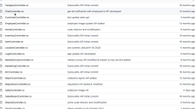
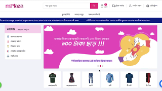
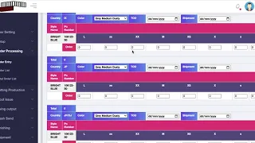

## 👨‍💻 Languages & Tools:

<table>
    <tbody>
        <tr>
            <td>
            </td>
            <td>
            </td>
            <td>
            </td>
            <td>
            </td>
            <td>
            </td>
        </tr>
        <tr>
            <td></td>
            <td></td>
            <td></td>
            <td>
            </td>
            <td></td>
        </tr>
        <tr>
            <td>
            </td>
            <td>
            </td>
            <td></td>
            <td></td>
            <td>
            </td>
        </tr>
        <tr>
            <td>
            </td>
            <td></td>
            <td></td>
            <td></td>
            <td></td>
        </tr>
    </tbody>
</table>

## 📺 Latest Project Videos (Click for YouTube Video)

<table>
<tbody>
<tr>
<td></td>
<td> <a href="https://www.youtube.com/watch?v=210Ni-uDMAw&t=212s">SALES FORCE APP (Confidence Salt)</a> #Android APP #Java  #ERP SYSTEM #.NET MVC API 
    #APP + API Developed by ME #No Teamwork #PROJECT_YEAR_2020-2021 Uploaded on May 9, 2021</td></tr>
<tr>
<td></td>
   <td><a href="https://www.youtube.com/watch?v=N0_sJUJqoHQ">SALES FORCE API (Confidence Salt)</a> #Code review on GitHub   #.NET MVC #API #MSSQL  #LinQ Queries #Repository Pattern  #Sales_Force #Mis_API #Developed by me #No Teamwork #PROJECT_YEAR_2020-2021 Uploaded on Dec 13, 2021</td></tr>
      <tr>
<td></td>
   <td><a href="https://www.youtube.com/watch?v=Xu3-Xom1uDQ">mPlaza.xyz (Founder)</a> #Customized_Bengali_Ecommerce   #PHP #Laravel #MySql #Javascript   #Entrepreneurship #Personal_Project #PROJECT_YEAR_2021 Uploaded on Dec 13, 2021</td></tr>  
<tr>  
<td></td>
<td><a href="https://www.youtube.com/watch?v=v1TrCBV4br8&t=1s">Attendance & HRM (Woodland,Kushtia)</a> #.Net Mvc # Javascript #Employee Tracking #Attendance  #HRM # 2500 employees # 12 Rotating Shifts #3_ZTecho_machines   # Developed by me #No Teamwork #PROJECT_YEAR_2018-19 Uploaded on Nov 14, 2020</td></tr>
<tr>
<td></td>
<td><a href="https://www.youtube.com/watch?v=KY59L-YDiqk&t=40s">Garments Production Management System (Starling Denims LTD,Savar)</a>  #PHP  #MySql #Javascript   #Developed by me #No Teamwork #PROJECT_YEAR_2019 Uploaded on Dec 13, 2021</td></tr>  
</tbody>
</table>

## 🔥  My contribution streak

    

## 📈  Github

📊   GitHub Profile Statistics
   
  
 

